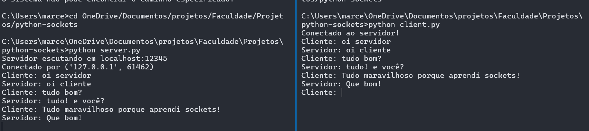

# Projeto de Chat com Sockets em Python

Esse código é referente ao trabalho da cadeira de Programação Paralela Distribuída, o código é um exemplo de **sockets TCP em Python**, feito para fins de estudo e demonstração de troca de mensagens via terminal.

---

## Requisitos

- Python 3.10 ou superior instalado
- Terminal (Prompt de Comando, PowerShell ou terminal do VS Code)
- Sistema operacional: Windows, Linux ou MacOS

---

## Instalação do Python

1. Acesse o site oficial: [https://www.python.org/downloads/](https://www.python.org/downloads/)
2. Baixe e execute o instalador da versão mais recente.

## Como executar
Execute esses dois comandos em terminais diferentes, na pasta do projeto:

### Primeiro terminal (server)
```bash
python server.py
```
### Segundo terminal (cliente)
```bash
python client.py
```
### O que acontece em tempo real

Quando você roda esses dois comandos, o que acontece é o seguinte:

- O **servidor** cria um socket TCP que **fica escutando** na porta 12345 do `localhost`.
- Quando o **cliente** é executado, ele cria seu próprio socket e tenta se conectar ao endereço `localhost:12345`.
- Com a conexão estabelecida, os dois programas conseguem trocar mensagens entre si: o cliente envia uma mensagem, o servidor responde, e assim por diante.
- Essa troca ocorre em **tempo real**, pois o socket mantém a conexão aberta até que uma das partes encerre.

---

### 💬 Exemplo real da comunicação no terminal

#### 🖥️ Terminal 1: Servidor (`server.py`)
```text
Servidor escutando em localhost:12345
Conectado por ('127.0.0.1', 54982)
Cliente: Olá, servidor!
Servidor: (você digita aqui) Oi, cliente!
Cliente: Tudo bem?
Servidor: Tudo ótimo!
```

#### 💻 Terminal 2: Cliente (`client.py`)
```text
Conectado ao servidor!
Cliente: Olá, servidor!
Servidor: Oi, cliente!
Cliente: Tudo bem?
Servidor: Tudo ótimo!
```

---



### 🛑 Como encerrar a conversa

O cliente pode sair a qualquer momento digitando:

```text
Cliente: sair
```

Isso encerrará a conexão e ambos os scripts serão finalizados.

